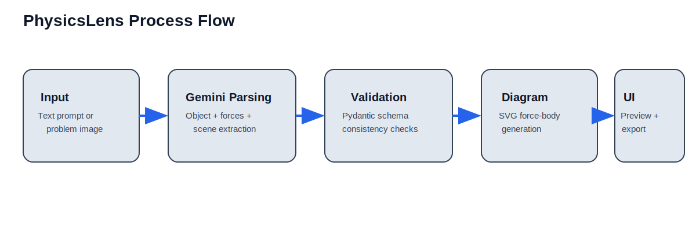
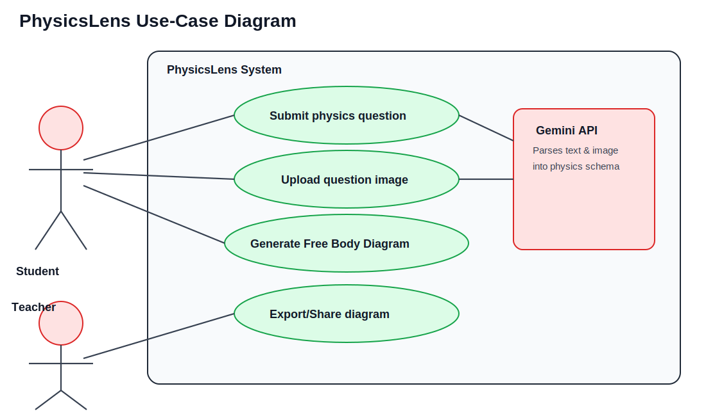
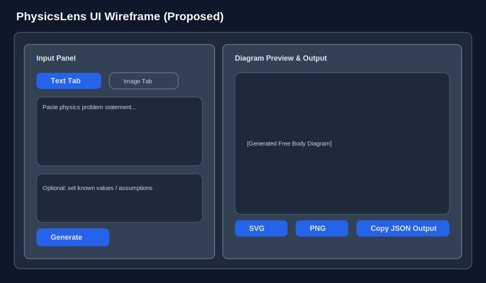
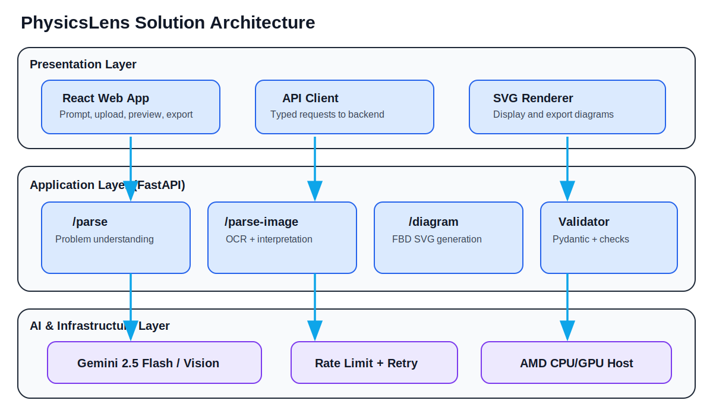

# PhysicsLens Hackathon PPT Content

## 1) Problem Statement
Students often struggle to convert textbook language into clear Free Body Diagrams (FBDs). This slows down problem-solving, causes incorrect force assumptions, and reduces confidence in Newtonian mechanics. Teachers also spend significant class time redrawing the same diagrams for repetitive question types.

---

## 2) Brief About the Idea
**PhysicsLens** is an AI-powered tool that takes a physics question as text or image input and automatically generates a color-coded Free Body Diagram. The platform parses scenario context (e.g., incline, pulley, horizontal, vertical), identifies all relevant forces, validates physics structure, and returns an exportable SVG diagram.

---

## 3) How is it Different from Existing Ideas?
Most existing tools either:
- are static drawing canvases requiring manual force placement,
- solve equations without visual reasoning,
- or support only one type of physics setup.

**PhysicsLens differentiators:**
- AI-first *problem understanding* (not just drawing).
- Multi-modal input (typed question + image upload/OCR).
- Scenario-aware diagram generation (incline, pulley, vertical, horizontal).
- Structured validation layer before rendering, reducing hallucinated outputs.
- Student-ready visuals with consistent force colors and export options.

---

## 4) How Will It Solve the Problem?
1. User provides a question (text or image).
2. Gemini parses physical entities and interactions.
3. Backend converts AI output into strict schema.
4. Validation ensures required force/object consistency.
5. Diagram engine renders standardized FBD instantly.
6. User exports visual for classwork, revision, or explanation.

This removes manual setup overhead and makes conceptual learning faster.

---

## 5) USP of the Proposed Solution
- **Instant “Question-to-Diagram” conversion** in one workflow.
- **Vision + text intelligence** for real classroom inputs.
- **Pedagogical consistency** using color-coded and structured force representation.
- **Hackathon-to-product readiness** with API-first architecture and modular generators.

---

## 6) List of Features Offered
- Input via typed text
- Input via question image upload
- OCR + AI interpretation of problem statements
- Automatic scenario classification
- Force extraction (gravity, normal, friction, applied, tension)
- Diagram generation for 4 physics setups
- Clean SVG output with frontend preview
- Download/export for notes and presentations
- API-driven architecture for LMS integration in future

---

## 7) Process Flow Diagram

---

## 8) Use-Case Diagram

---

## 9) Wireframes / Mock Diagrams (Optional)

---

## 10) Architecture Diagram

---

## 11) Technologies Used
### Frontend
- React + TypeScript + Vite

### Backend
- FastAPI + Uvicorn
- Pydantic v2 for schemas and validation

### AI Layer
- Google Gemini 2.5 Flash (text parsing)
- Gemini Vision capabilities (image understanding)

### Reliability & Ops
- `tenacity` for retries
- `slowapi` for rate-limiting
- `pytest` for tests

---

## 12) Usage of AMD Products/Solutions
Potential and current AMD-aligned usage in the hackathon context:
- Hosting backend/frontend on AMD EPYC-powered cloud instances for cost-efficient inference orchestration.
- Running local development and demos on AMD Ryzen laptops for smooth full-stack execution.
- Future acceleration path: containerized deployment optimized for AMD infrastructure and open software stacks.

> Note for judges: while AI model inference is provided via API, the app compute and deployment layers are AMD-friendly and can be benchmarked on AMD instances.

---

## 13) Estimated Implementation Cost (Optional)
### Prototype (Hackathon stage)
- Infra (demo hosting): **$0–$30/month** (credits/free tiers possible)
- API usage (Gemini low-volume): **$10–$50/month**
- Domain + misc: **$1–$2/month (annualized)**

### Pilot in one institute
- Infra (scalable backend + frontend): **$80–$200/month**
- Model/API usage (higher student traffic): **$150–$600/month**
- Maintenance/devops support: **part-time team cost**

---

## 14) Suggested Slide Split (Ready-to-use)
1. Title + Team + Hackathon
2. Problem Statement
3. Why now? Learning pain points
4. Our Idea (PhysicsLens)
5. What makes us different
6. How it works (flow)
7. Use-case diagram
8. Product architecture
9. Features and demo snapshots
10. AMD usage alignment
11. Implementation cost & roadmap
12. Thank you / Q&A
