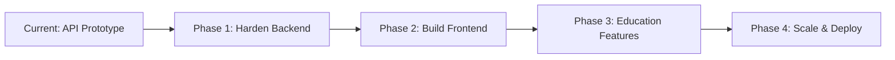

# PhysicsLens — Implementation Roadmap

## Current State vs. Vision

### What You Have Now
| Component | Status | Details |
|-----------|--------|---------|
| FastAPI backend | ✅ Basic | Single [main.py](file:///d:/projects/amd_slingshot/PhysicsLens/main.py), 3 endpoints |
| AI Parsing | ✅ Prototype | Gemini 2.5 Flash, hardcoded prompt, JSON output |
| SVG Diagrams | ✅ Minimal | Server-side Python SVG strings, incline only |
| Frontend | ❌ None | No UI — API-only |
| State management | ❌ None | No Zustand/Redux |
| D3.js rendering | ❌ None | Using Python string templates instead |
| Export (PNG/SVG) | ❌ None | |
| Deployment | ❌ None | Local only |
| Rate limiting | ❌ None | |
| Tests | ❌ None | |
| Multilingual | ❌ None | English only |

### The Gap
Your current codebase is a **bare-minimum API proof-of-concept**. The research guide describes a **production education product**. The work ahead is roughly:

---

## Phase 1 — Harden the Backend & AI Parsing

> **Goal:** Make the `/parse` endpoint robust enough to handle real NCERT/JEE problems reliably.

### 1.1 Improve the parsing prompt
- Add few-shot examples (3-5 real NCERT problems with expected JSON output)
- Handle edge cases: multiple objects, stacked blocks, pulleys, connected systems
- Add support for more force types: `normal`, `tension`, `spring`, `friction_force`
- Support more surface types: `pulley`, `horizontal_surface`, `vertical_wall`

### 1.2 Pydantic schema validation
- Replace raw `dict` with proper Pydantic models for the parsed output
- Validate that `object_id` references in forces/placements exist in the objects list
- Add error messages that explain *what* the parser couldn't understand

### 1.3 Add more diagram types
Currently only inclines. Need:
- Horizontal surface with friction
- Pulley systems (single and compound)
- Connected blocks on surfaces
- Vertical scenarios (elevator, hanging objects)

### 1.4 Rate limiting & error handling
- Add `slowapi` for rate limiting
- Proper HTTP error codes and messages
- Retry logic for Gemini API failures

---

## Phase 2 — Build the React + D3.js Frontend

> **Goal:** A polished web UI where students paste a problem and see an interactive FBD.

### 2.1 Scaffold the frontend
- Vite + React + TypeScript
- Tailwind CSS for styling
- Zustand for state management

### 2.2 Core UI layout
- **Left panel:** Text input (paste/type your physics problem)
- **Right panel:** D3.js SVG canvas showing the FBD
- **Bottom panel:** Step-by-step solution breakdown (progressive disclosure)

### 2.3 D3.js diagram renderer
- Replace Python SVG generation with client-side D3.js
- Interactive: hover force arrows to see magnitude/direction
- Animated: forces appear one-by-one to teach the construction process
- Color-coded force types (gravity=blue, normal=green, friction=orange, applied=red)

### 2.4 Export functionality
- FileSaver.js for PNG/SVG download
- Copy-to-clipboard for SVG

---

## Phase 3 — Educational Features

> **Goal:** Go from "tool" to "tutor."

- Step-by-step FBD construction walkthrough
- Show Newton's equations derived from the FBD
- Calculate acceleration, net force, etc.
- "What if" mode — change mass/angle/force and watch the diagram update live

---

## Phase 4 — Deploy & Scale (v2)

- Deploy to Railway or Render
- Hindi/Tamil support via Bhashini API
- JEE/NEET problem bank for testing
- User accounts + saved problems (optional)

---

## User Review Required

> [!IMPORTANT]
> **Key decisions before we start building:**

1. **Which phase do you want to tackle first?** I'd recommend Phase 1 (hardening the parser) since it's the core value prop, but if you need a demo for the hackathon soon, Phase 2 (frontend) might be more visually impactful.

2. **AI provider:** Your research guide mentions Anthropic/Claude, but the current code uses Gemini. Do you want to **switch to Claude** for the structured parsing, or **stay with Gemini**?

3. **Frontend stack:** The guide says React + Vite + Tailwind + Zustand + D3.js. Are you comfortable with this stack, or would you prefer something simpler for the hackathon (e.g., plain HTML + vanilla JS + D3)?

4. **Hackathon deadline?** Knowing the timeline changes what we prioritize. If it's days away, we ship a polished demo. If it's weeks, we can build it properly.

---

## Verification Plan

### Phase 1 Verification
- Create a test set of 10 real NCERT/JEE physics problems
- Run each through the `/parse` endpoint and validate JSON output
- Manual check: do the generated diagrams match what a physics textbook would show?

### Phase 2 Verification
- Browser testing: paste problems, verify diagrams render correctly
- Test export: download PNG/SVG, verify they open correctly
- Responsive design check on mobile viewport

### Manual Testing
- Compare PhysicsLens output against GeoGebra/PhET for the same problem
- Have a physics student verify FBD correctness
